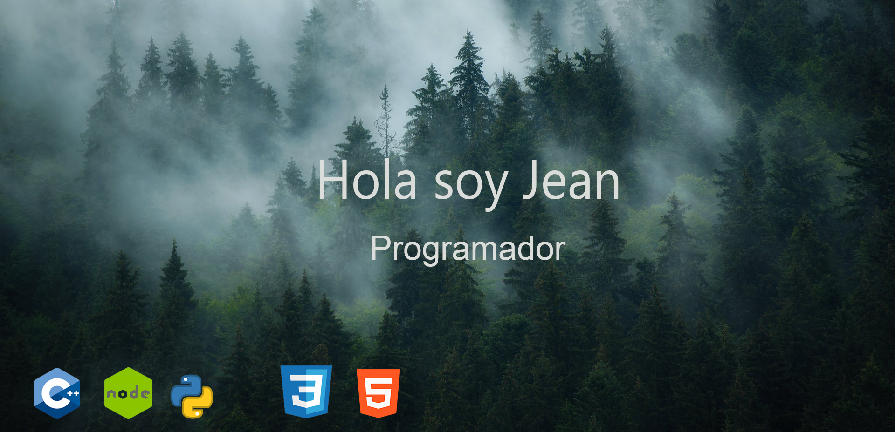
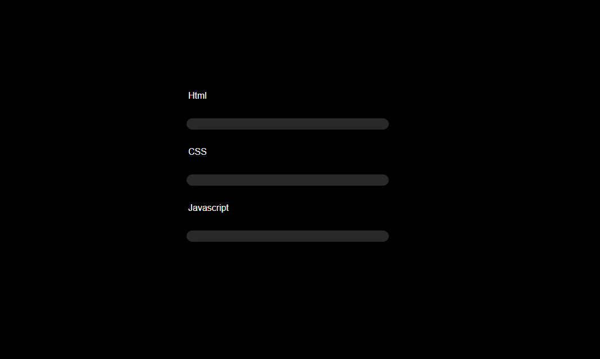
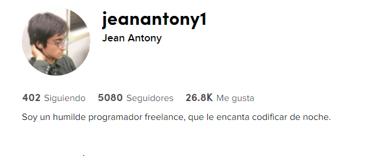

<h2 align="center" > 
  My Github Stats
</h2>

  

  

| Niebla | Form3d |
| ------------- | ------------- |
| C++ | 60% |
| Python | 60% |
| Nodejs | 75% |
| Javascript | 80% |
| PHP | 75% |
| HTML | 90% |
| CSS | 90% |

<h1>Tiktok</h1>

<h1>Portafolio</h1>

|fromGreen|
|------------|
||

|MarijuanaApp| fromGreen   |
|------------|------------|
| ||

|LoginDeplege| LoginDeplege|
|----------------|----------------|
|||

|ProgressColor v2|TrackBarHabilidades|
|----------------|----------------|
|||

| Niebla |  loadColor |
| ------------- | ------------- |
|  |      

| Niebla | Form3d |
| ------------- | ------------- |
|    |    |

| NeonBotonV1 | DropDown |
| ------------- | ------------- |
|||

| rippleExample | AnimationForm |
| ------------- | ------------- |
|||

| menuDesplaz | TargetDesplace |
| ------------- | ------------- |
|||

| ProgresBarCircle | SpacedMaketaV1 |
| ------------- | ------------- |
|||

| SocialTikets3d | tarjetas3d |
| ------------- | ------------- |
|||

| Efecto-Matrix | 
| ------------- | 
||

